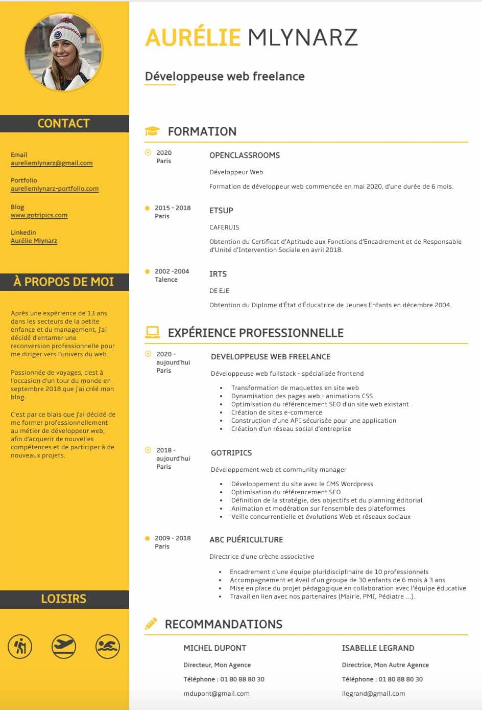
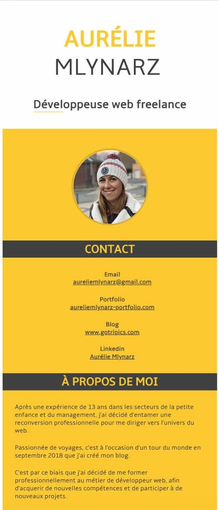

## Intégration d'un maquette

### Ma mission

Transformer une maquette en site web.

### Les technologies utilisées

    - HTML5
    - CSS3
    - Git / GitHub

### Le projet

Pour que votre site soit **votre reflet** et **réponde à vos besoins** et ainsi qu'à **ceux de vos clients**, je peux vous aider en le créant à partir d'une **maquette de votre choix**.

Prenons ici l'exemple de mon CV. Pour le réaliser je suis partie de la maquette suivante :

J'ai commencé par découper les différents éléments, puis les ai traduits en **HTML5 et CSS3** pour les intégrer à la page web :

Afin que cette page s'adapte à toutes tailles d'écran, j'ai défini un format **responsive** qui transforme ce cv en une colonne sur les écrans de moins de 1000 pixels.

### Pour consulter le projet

Pour ce projet, j'ai utilisé le **logiciel de versionning Git**. Il est hébergé gratuitement avec **GitHub Pages**.

Vous pouvez le consulter ici : [mon cv](https://lilimly.github.io/cv_aurelie_mlynarz/ "Lien vers mon CV").

Retrouvez le **code source** de ce projet sur [mon espace GitHub](https://github.com/Lilimly/cv_aurelie_mlynarz "Code source de mon CV").