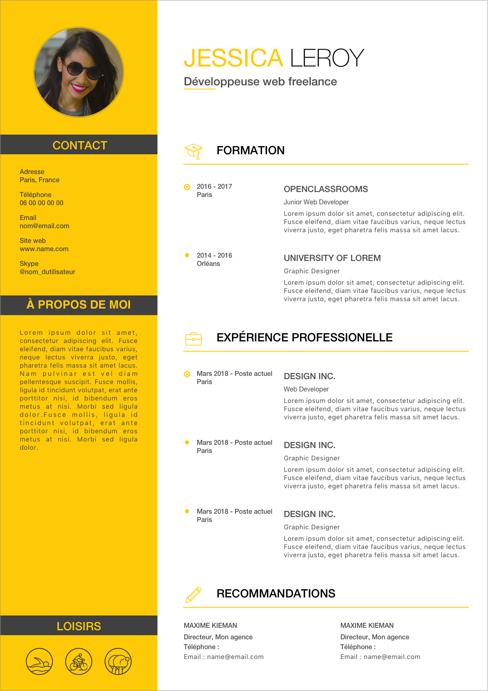
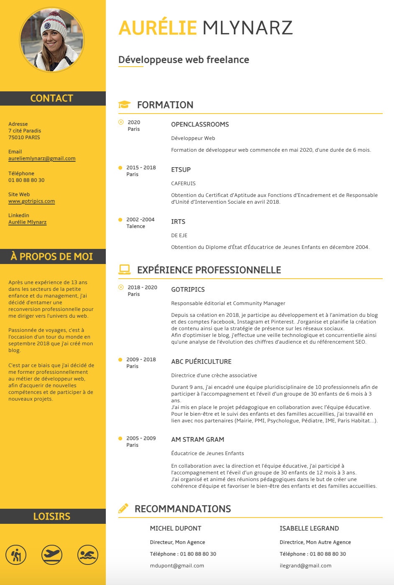
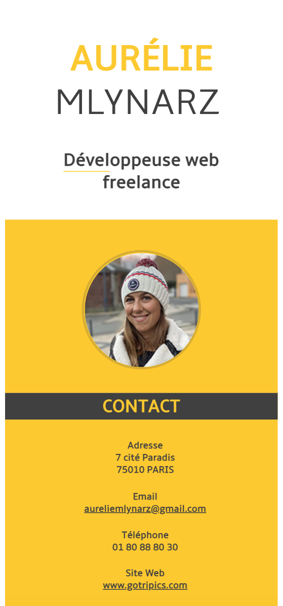

## Intégration d'un maquette à un site web

* **Techniques utilisées** : 
    * HTML5 
    * CSS3 
    * Git

Pour que votre site soit votre reflet et réponde à vos besoins et ceux de vos clients, je peux vous aider en le créant à partir d'une maquette de votre choix.

Prenons ici l'exemple de mon CV. Pour le réaliser je suis partie d'une **maquette**.

Maquette d'origine :

 

J'ai commencé par découper les différents éléments.
Je les ai ensuite intégrés à la page web pour la reproduire à l'identique en les traduisants en **HTML5 et le CSS3**.

Résultat :

Aujourd'hui, la majorité des sites sont consultés sur téléphone.

Il est donc essentiel d'avoir un site qui s'adapte à toutes tailles d'écrans pour améliorer l'expérience utilisateur de vos clients actuels et élargir votre public !

Afin que cette page s'adapte à toute taille d'écran, j'ai créé un **responsive** qui transforme ce cv en une colonne sur les écrans de moins de 1000 pixels.

Voici un exemple du rendu sur un écrande de 375 pixels de large :

Pour l'ensemble de ce projet j'ai utilisé le **logiciel de versionning Git** et il est hébergé gratuitement avec GitHub Pages. Vous pouvez le consulter : [mon cv](https://lilimly.github.io/cv_aurelie_mlynarz/).

N'hésitez pas à tester le responsive sur différentes tailles d'écran !

Retrouvez le **code source** de ce projet sur [mon espace GitHub](https://github.com/Lilimly/cv_aurelie_mlynarz)