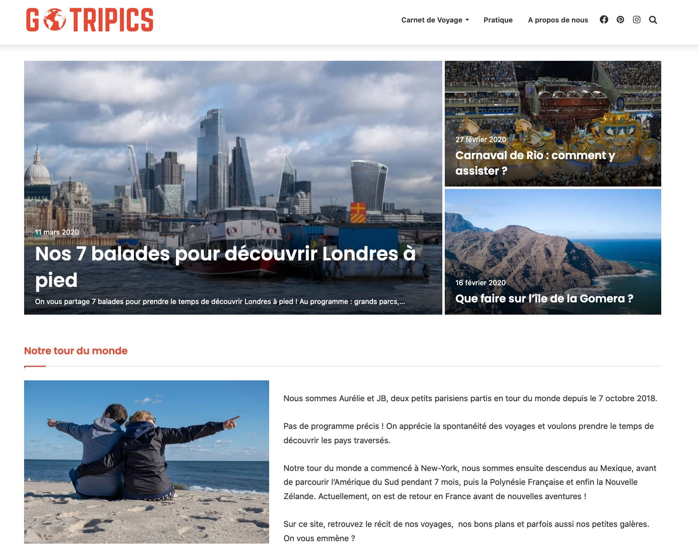
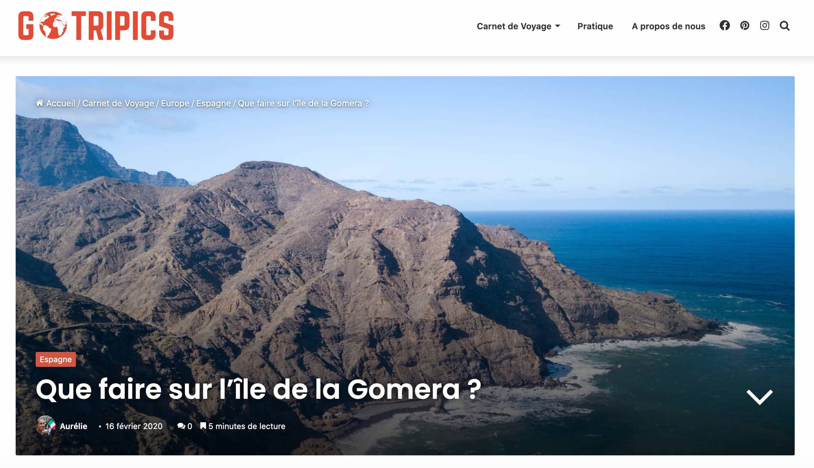

## Création d'un blog de voyage

### Ma mission

Créer mon blog de voyage avec le CMS Wordpress.

### Les technologies utilisées

    - Wordpress
    - Mailchimp
    - Google Analytics
    - Google Search Console

### Le projet

Au cours d'un voyage d'**un an autour du monde** j'ai décidé de créer mon **blog de voyages**.

#### Composition du site

- une page d'accueil répertoriant les derniers carnets de voyage
- des pages articles, classées par continent et par pays
- une page biographie
- des liens vers les comptes Instagram, Facebook et Pinterest liés au blog

#### Compétences développées

Dans ce cadre j'ai développé les **compétences** suivantes :

- Développement du site avec le **CMS Wordpress**
- Optimisation du **référencement SEO**
- Définition de la **stratégie**, des **objectifs** et du **planning éditorial**
- **Création du contenu** du site et des réseaux sociaux
- **Veille concurrentielle** et évolutions Web et réseaux sociaux
- **Animation** et **modération** d'une communauté de **4000 abonnés**
- Suivi et analyse de l'évolution des **chiffres d'audience**
- Élaboration et suivi des **newsletters**

### Pour consulter le projet

Vous pouvez retrouver mon blog à l'adresse [gotripics.com](https://www.gotripics.com/ "Consulter mon blog").
