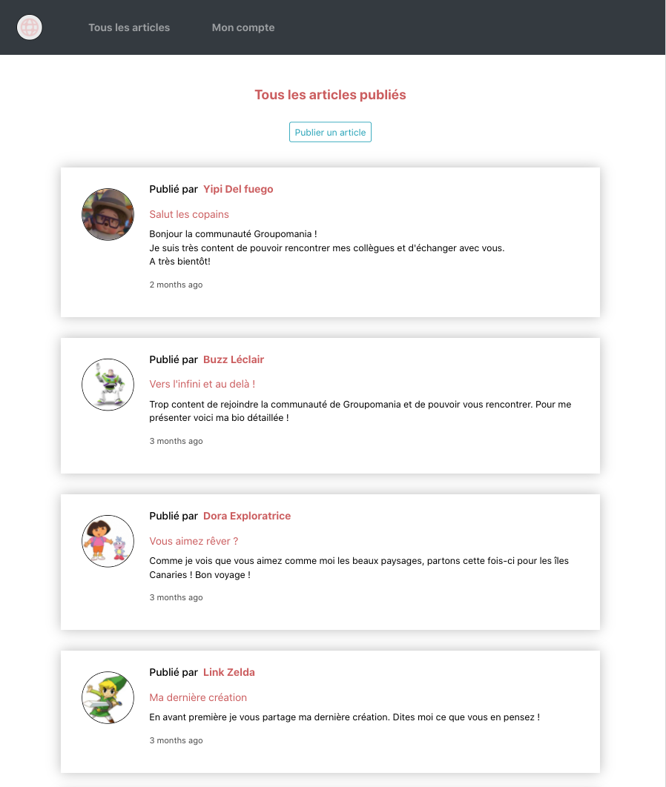
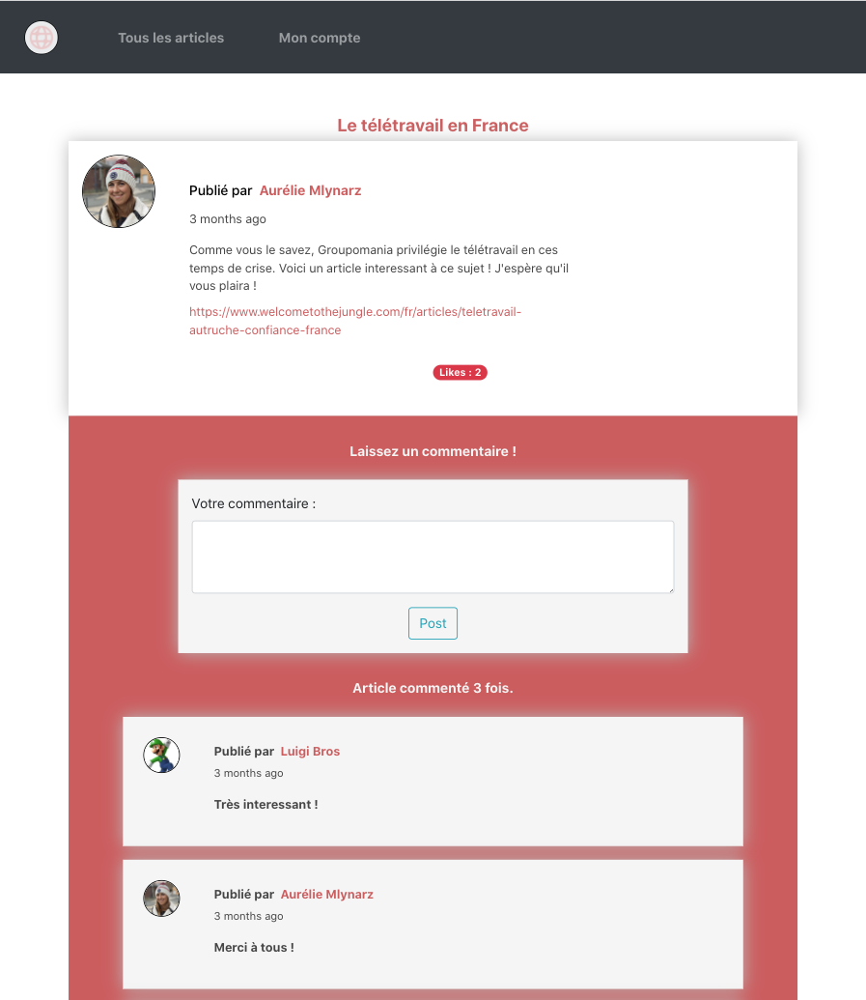
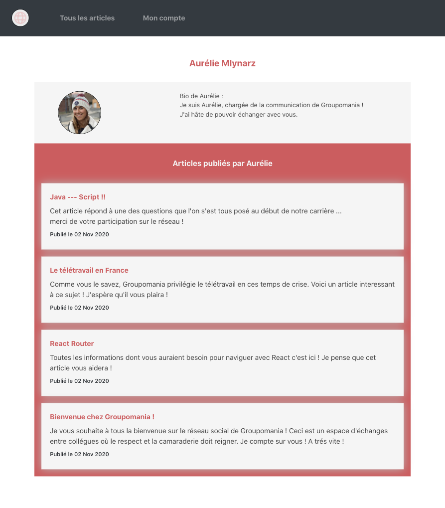

## Création d'un réseau social d’entreprise

* Technologies utilisées :
    * Coté front: JavaScript / React / Bootstrap
    * Coté Back : Node.JS / Express.JS
    * Base de données : mySQL / Sequelize

Réseau social d'entreprise sécurisé : 

Page d'inscription ou connexion sécurisée : 

Page accueil avec l'ensemble des post de la communauté, dans l'ordre du plus récent au plus ancien :

page post, possibilité de créer un post et de le modifier ou supprimer pour la personne qui l'a créé. Un utilisateur peut également laisser un commentaire :

Page compte utilisateur, avec les différents articles qu'il a créé, sa photo et sa biographie (possibilité de modifier ou supprimer le compte si l'on est le proproétaire) :

Compte administrateur qui peut modifier ou supprimer article, commentaires et utilisateur.

Retrouvez le **code source** de ce projet sur [mon espace GitHub](https://github.com/Lilimly/groupomania)