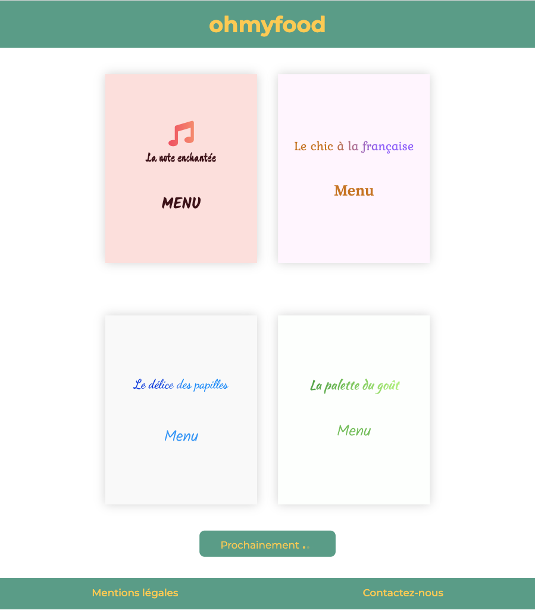
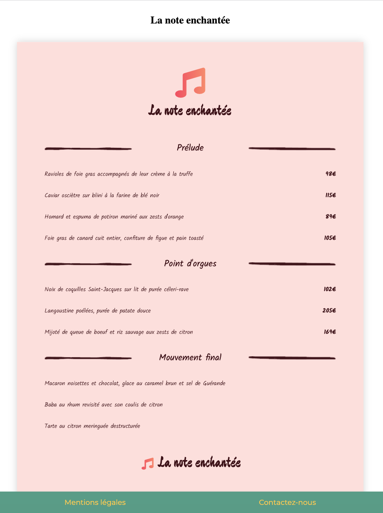

## Dynamisation d'une page web

**Ma mission** : Dynamisez une page web avec des animations CSS

**Les technologies utilisées** : 
    - HTML5
    - CSS3 
    - SASS
    - Git

Sur ce projet, j'ai intégré une maquette pour développer le site Ohmyfood en y insérant différentes animations et des dégradés de couleurs CSS pour le rendre plus interactif.

* Le projet est composé de 6 pages :
    * une page d'accueil
    * 4 pages menu
    * 1 page pour les mentions légales

Voici la page d'accueil :

Et un exemple d'une page menu :

Pour l'ensemble de ce projet j'ai utilisé le **logiciel de versionning Git** et il est hébergé gratuitement avec GitHub Pages. Vous pouvez le consulter : [Ohmyfood](https://lilimly.github.io/ohmyfood/ "Lien vers le site Ohmyfood").

Pour organiser mon code CSS j'ai utilisé le pré-processeur SASS.

Retrouvez le **code source** de ce projet sur [mon espace GitHub](https://github.com/Lilimly/ohmyfood "Code source du site Ohmyfood")