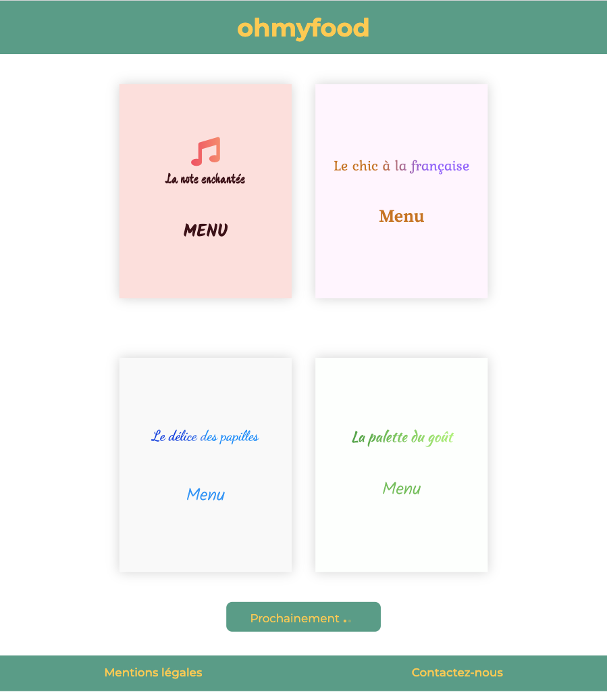
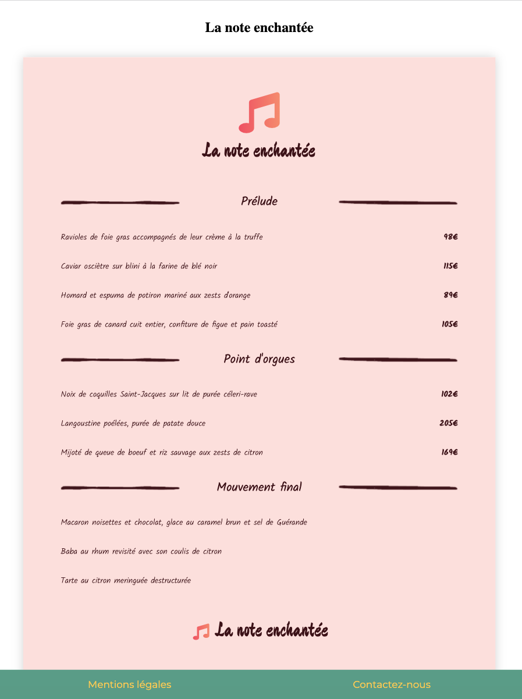

## Dynamisation d'une page web

### Ma mission

Dynamiser une page web avec des animations CSS.

### Les technologies utilisées

    - HTML5
    - CSS3
    - SASS
    - Git / GitHub

### Les étapes du projet

Le site se compose de :

- une page d'accueil
- 4 pages menu
- 1 page pour les mentions légales
- 1 section "contactez-nous"

Pour développer le site Ohmyfood, j'ai **intégré une maquette** en respectant les différentes polices, couleurs, dégradés ainsi que des **animations CSS** demandées pour le rendre plus interactif.

La page d'accueil présente les cartes des menus disponibles. Lorsqu'on les survole avec la souris, les cartes ont un effet de zoom pour montrer à l'utilisateur que l'on peut cliquer dessus.

Au clic sur chacune des cartes, le menu détaillé est dévoilé.

L'ensemble du site est responsive afin de s'adapter à toutes tailles d'écran et de garantir une bonne expérience utilisateur.

### Pour consulter le projet

Pour ce projet, j'ai utilisé le **logiciel de versionning Git**. Il est hébergé gratuitement avec **GitHub Pages**.

Vous pouvez le consulter ici : [Ohmyfood](https://lilimly.github.io/ohmyfood/ "Lien vers le site Ohmyfood").

Retrouvez le **code source** de ce projet sur [mon espace GitHub](https://github.com/Lilimly/ohmyfood "Code source du site Ohmyfood")
