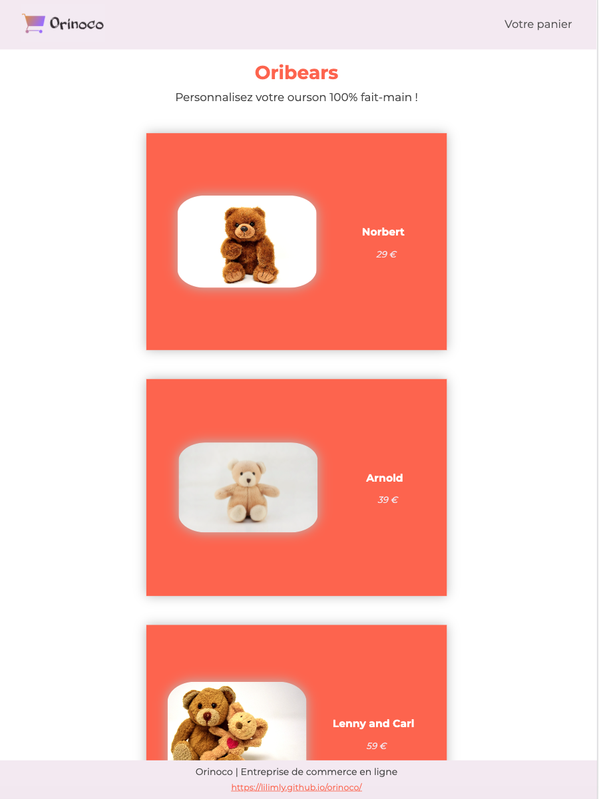
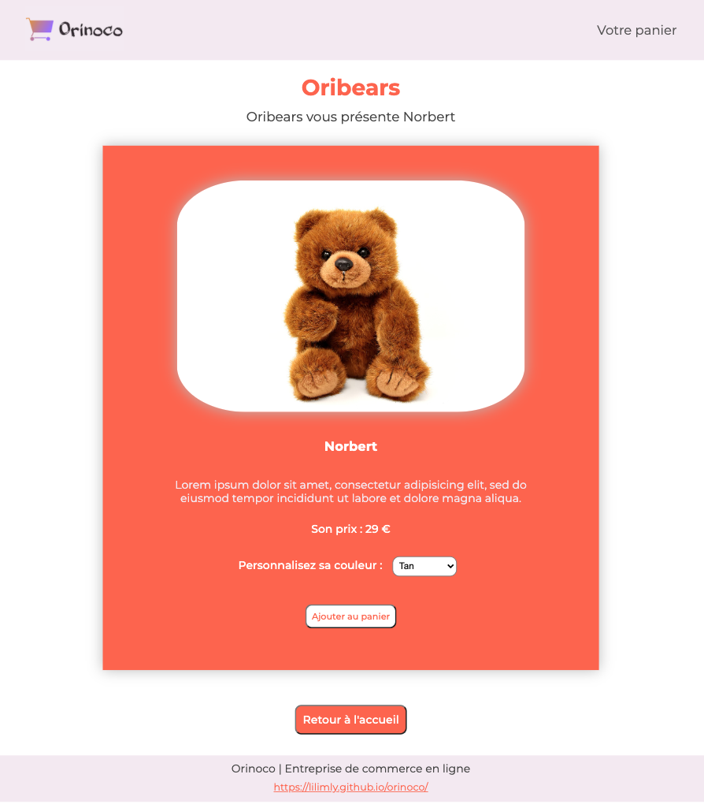
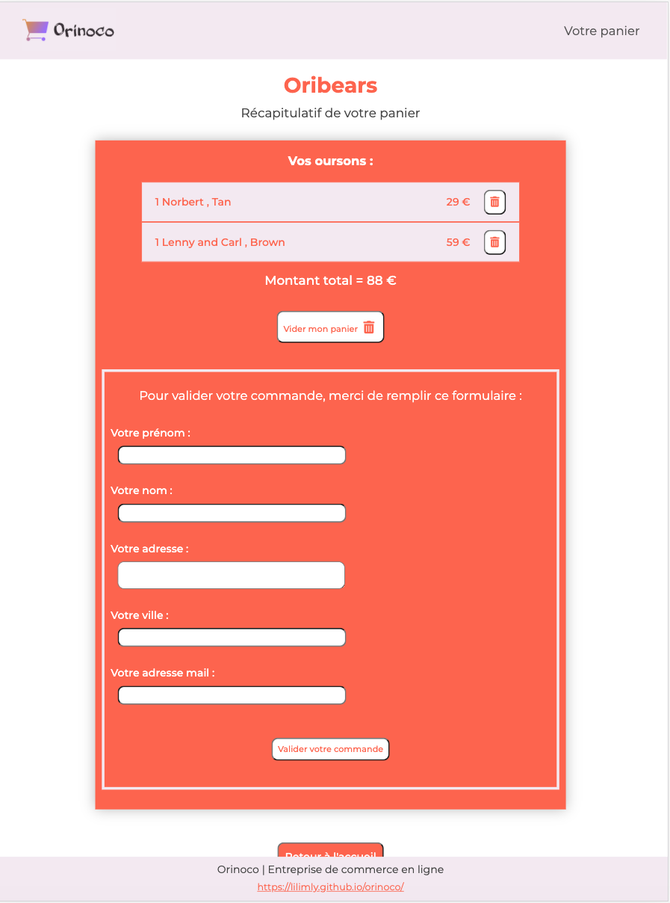
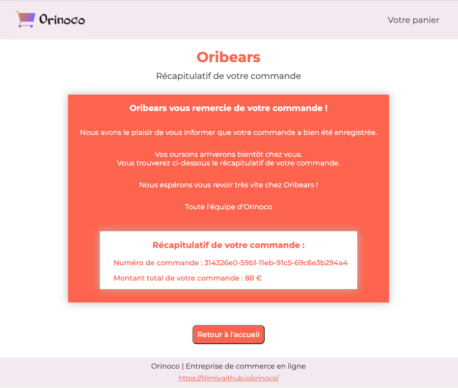

## Création d'un de site e-commerce

### Ma mission
Développer le frontend d'une application de vente en ligne.

### Les technologies utilisées
    - JavaScript
    - HTML5
    - CSS3
    - SASS
    - Git / GitHub

### Les étapes du projet
Le site se compose de :
* une page d'accueil
* une page descriptive pour chaque produit
* 1 page panier
* 1 page de confirmation de commande

Pour réaliser ce site de **e-commerce**, j'ai dans un premier temps récupéré les données des produits à mettre en vente depuis une **API**.

A la connexion sur le site, la page d'accueil nous affiche les différents oursons disponibles, sous forme de cartes.

Au clic sur l'une des cartes, une page produit apporte des informations plus détaillées. Elle offre également la possibilité de choisir la couleur de l'ourson et de l'ajouter au panier :

Dans la barre de navigation du site, un lien permet de consulter son panier à tout moment.

Cette page panier offre un récapitulatif des articles commandés, le prix total et le formulaire de commande.

Une fois la commande passée, une page de confirmation récapitule la commande faite et offre la possibilité de retourner à la page d'accueil du site.

Pour vérifier le bon fonctionnement des différentes étapes de l'application, j'ai rédigé un **plan de tests unitaires** où sont détaillés :
- les différents points à tester : les actions demandées
- la façon dont doit se comporter l'application : les résultats attendus

### Pour consulter le projet
Pour ce projet, j'ai utilisé le **logiciel de versionning Git**.

Retrouvez le **code source** sur [mon espace GitHub](https://github.com/Lilimly/orinoco "Code source du site Orinoco")