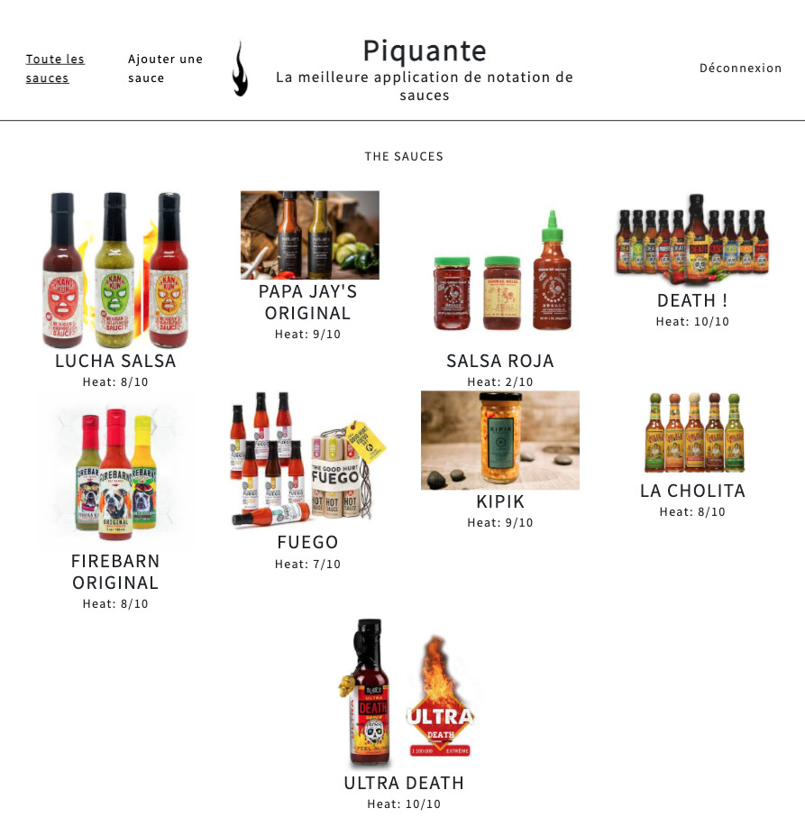
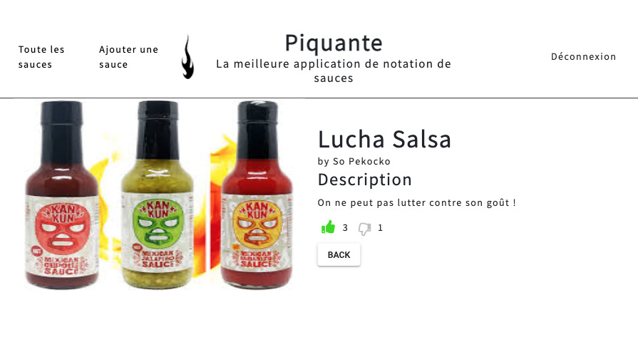
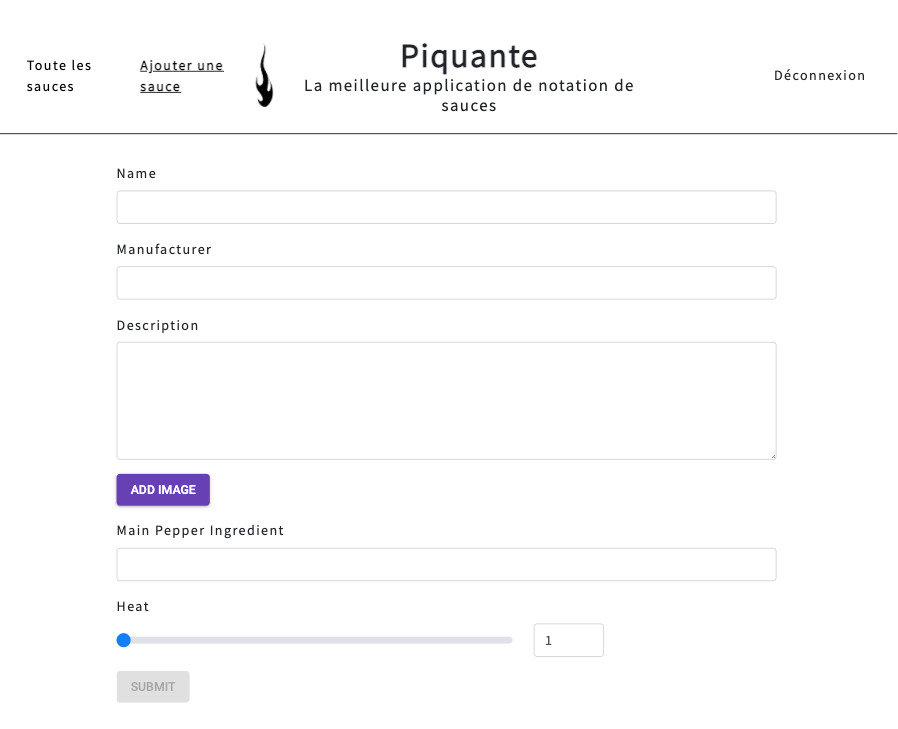

## Construction d'une API sécurisée

### Ma mission

Développer le backend d'une application d'avis gastronomique.

### Les technologies utilisées

    - Serveur : Node.JS / Express.JS
    - Base de données : MongoDB

### Le projet

Le site se compose de :

- une page de connexion ou d'inscription
- une page d'accueil
- une page descriptive pour chaque sauce à noter
- 1 page création de sauce

Pour ce projet, j'ai créé le backend d'un site de notation de sauces.

Pour celà j'ai créé une API REST (Representational State Transfer).

Dans un premier temps, l'utilisateur arrive sur une page d'inscription ou de connexion sécurisée : son email et son mot de passe sont enregistrés de façon cryptés dans la base de données Mongo DB).

Une fois authentiflié, l'utilisateur est dirigé sur la page d'accueil qui présente les différentes sauces créées.

Une page produit affiche les informations précises de la sauce. L'application offre la possibilité de liker ou disliker les sauces.

L'utilisateur peut également créer une nouvelle sauce. Pour plus de sécurité, il ne pourra supprimer ou modifier que les sauces qu'il a créé.

### Pour consulter le projets

Pour ce projet, j'ai utilisé le **logiciel de versionning Git**.

Retrouvez le **code source** sur [mon espace GitHub](https://github.com/Lilimly/piquante "Code source du site Piquante")
