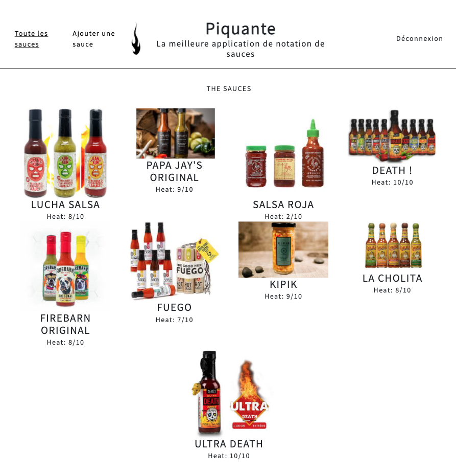

## Construction d'une API sécurisée

**Ma mission** : Développer le backend d'une application d'avis gastronomique.

**Les technologies utilisées** : 
    - Serveur : Node.JS / Express.JS
    - Base de données : MongoDB

Développement du Backend de cette application d'avis gastronomiques.

Pour ce projet, j'ai créé routes et API user et sauces à noter.

Création d'une API REST (Representational State Transfer) =
style d'architecture définissant un ensemble de conventions à utiliser pour créer des services web.

Page d'inscription ou de connexion sécurisée: 

Ensuite page d'accueil des différentes sauces : 

Page d'une sauce en particulier avec possibilité de liker ou disliker :

Ajout d'une sauce:

Retrouvez le **code source** de ce projet sur [mon espace GitHub](https://github.com/Lilimly/piquante "Code source du site Piquante")