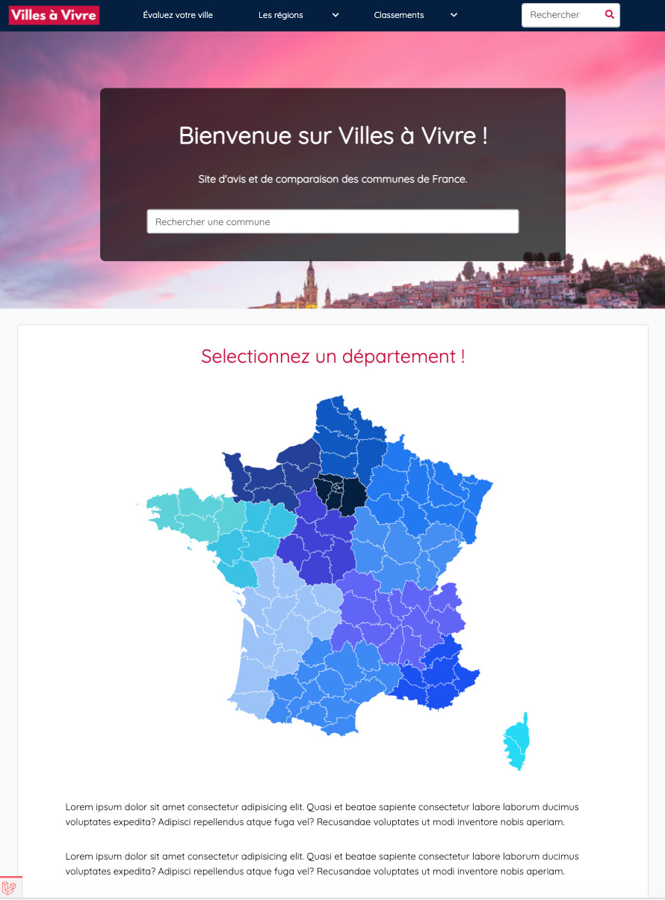

## Développement du frontend du site

### Ma mission

Développer le frontend d'un site d'avis et de comparaison de villes.

( Projet en cours de développement !)

### Les technologies utilisées

    - Vue JS
    - Nuxt JS
    - SASS
    - Git / GitHub

### Le projet

Développement d'une partie du Frontend de ce site de comparaisons de villes développé en Vue.JS.

### Pour consulter le projet

Un peu de patience, vous pourrez bientot consulter ce projet !
