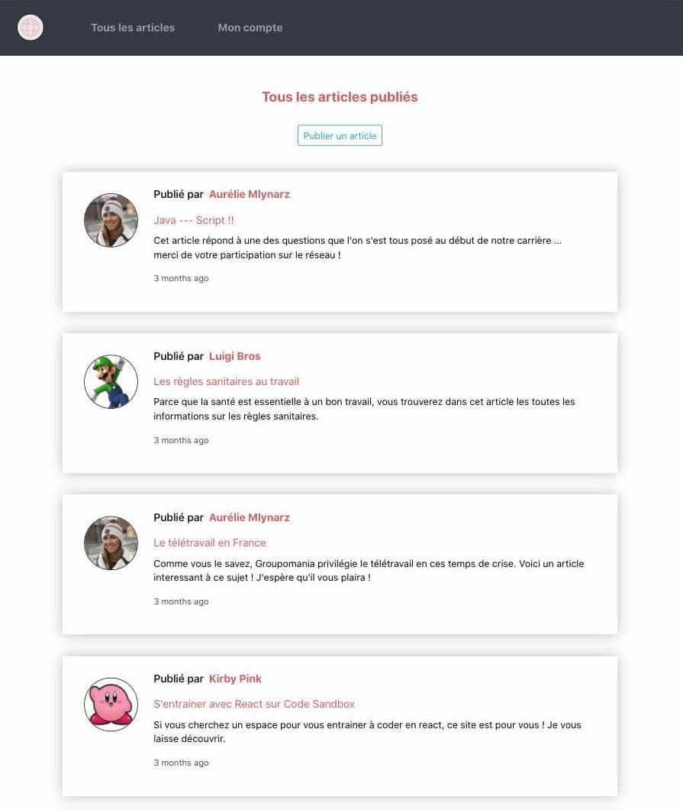
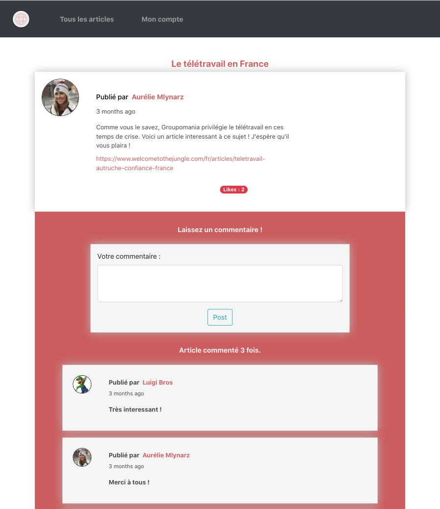
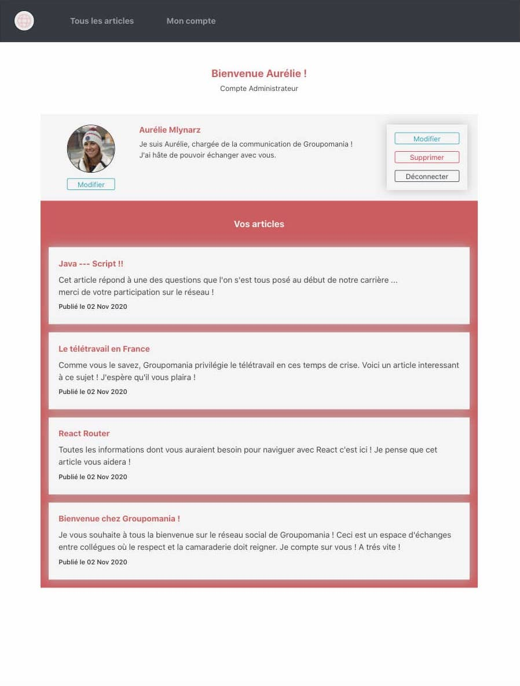

## Création d'un réseau social d’entreprise

### Ma mission

Développement fullstack du réseau social d'une entreprise.

### Les technologies utilisées

    - Front :
    JavaScript / React / Bootstrap

    - Back :
    Node.JS / Express.JS

    - Base de données :
    mySQL / Sequelize

### Le projet

#### Composition du site

- une page de connexion ou d'inscription
- une page d'accueil
- une page descriptive pour chaque article
- une page descriptive du compte de chaque utilisateur
- un compte administrateur

#### Page d'inscription / de connexion

Pour accéder au réseau social, l'utilisateur devra créer un compte, ce qui l'enregistrera de manière **sécurisée** dans notre base de données **mySQL** (email et mot de passe cryptés).

#### Page d'accueil

Une fois authentifié, l'utilisateur accéde à la page d'accueil qui affiche l'ensemble des articles postés, dans l'ordre **du plus récent au plus ancien**.

#### Ajout d'un article

Chaque utilisateur a la possibilité de publier un nouvel article.

#### Les pages articles

En cliquant sur un article, l'utilisateur peut consulter son intégralité. Un utilisateur pourra uniquement modifier ou supprimer un article qu'il aura créé.

Il pourra également laisser un commentaire.

#### Les comptes utilisateurs

L'application offre également la possibilité de consulter les comptes des utilisateurs affichant leur biographie, leur photo ainsi que les différents articles qu'ils ont postés.

Un utilisateur pourra uniquement modifier ou supprimer son propre compte.

#### Un compte administrateur

Afin de modérer ce réseau social, un compte **administrateur** est défini. Ce dernier pourra modifier ou supprimer des articles, des commentaires mais également des comptes utilisateurs.

### Consulter le projet

Pour ce projet, j'ai utilisé le **logiciel de versionning Git**.

Retrouvez le **code source** sur [mon espace GitHub](https://github.com/Lilimly/groupomania "Code source du site Groupomania")
