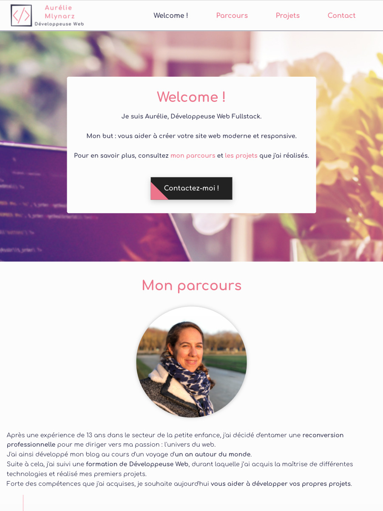
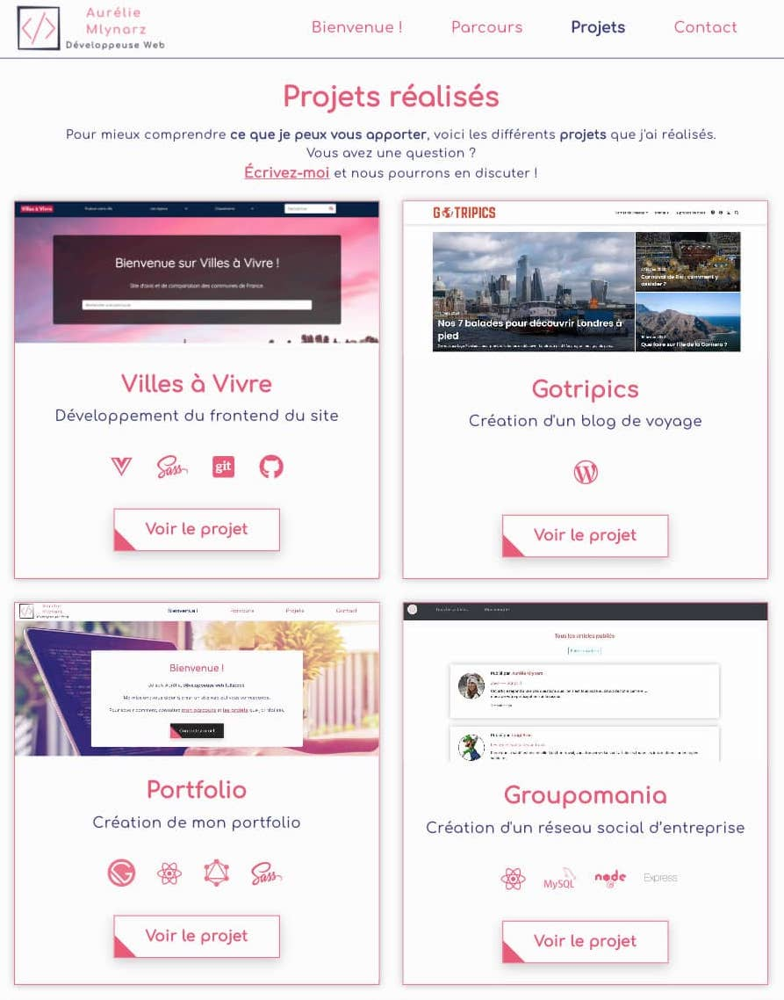

## Création de mon portfolio

### Ma mission

Création de mon portfolio.

### Les technologies utilisées

    - Gatsby
    - React JS
    - GraphQL
    - SASS
    - Git / GitHub
    - Netlify

### Le projet

Pour développer ce projet, j'ai choisi d'utiliser le **générateur de site statique Gatsby**.

#### Pourquoi un SSG ?

Les générateurs de sites statiques sont une **alternative** aux systèmes de gestion de contenu (CMS) basés sur des bases de données, tels que **WordPress** et **Drupal**.

Ils permettent de récupérer l'**ensemble des données en une seule fois**, puis de les enregistrer. Celà évite de faire des appels à un backend à chaque visite d'un utilisateur.

Les SSG **réduisent ainsi la complexité** du site, ce qui améliore la **vitesse**, la **sécurité** et **facilite l'hébergement et l'expérience des développeurs**.

#### Le choix de GatsbyJS

GatsbyJS, est donc un SSG construit avec **ReactJS** et alimenté par **GraphQL**.

Ses **3 principaux avantages** :

- **La vitesse**

Construit avec ReactJS, Gatsby ne génére pas de page à chaque requête.
Celà rend le site plus rapide et donc l'**expérience utilisateur** plus **fluide**.

- **Plus de sécurité**

Le site étant statique, il est **moins vulnérable** aux attaques et aux tentatives de piratage.

- **Une économie sur le coûts d'hébergement**

Contrairement à un site dynamique, l'hébergement d'un site GatsbyJS peut se faire sur différents types de serveurs, ce qui **réduit le coût de l’hébergement**.
Par exemple, ce portfolio est hébergé gratuitement sur **Netlify**.

#### Traitement des requêtes avec GraphQL

Comme l'indique son nom, GraphQL (Query Language) est un **langage de requêtes** pour API.
Il permet de manipuler de la donnée de façon **simple, flexible et précise**.
Les requêtes sont déclaratives et personnalisées: on ne va récupérer que **les données dont on a besoin** et **dans l'ordre que l'on souhaite**.

C'est également un **environnement d'exécution** qui interpréte et structure les requêtes à partir d'un schéma.

### Consulter le projet

Pour ce projet, j'ai utilisé le **logiciel de versionning Git**.

Retrouvez le **code source** sur [mon espace GitHub](https://github.com/Lilimly/portfolio "Code source de mon portfolio")
