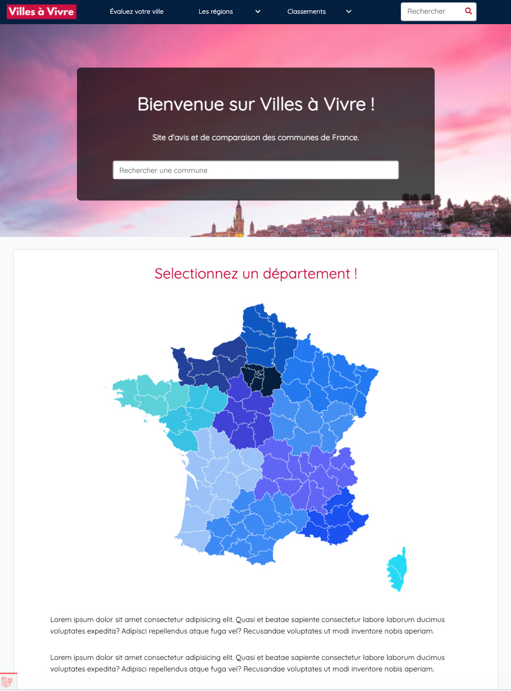

## Développement du frontend web et mobile

### Ma mission

Développer le frontend web et mobile d'un site d'avis et de comparaison de villes.

### Les technologies utilisées

    - Vue JS
    - React Native
    - TypeScript
    - Algolia
    - Leaflet
    - SASS
    - Git / GitHub

### Consulter le projet

Consultez [Villes à Vivre](https://www.villesavivre.fr/ "Consulter Villes à Vivre"), site d'avis et de comparaison des communes de France.
